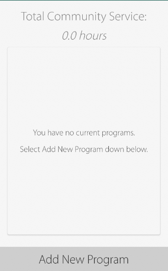
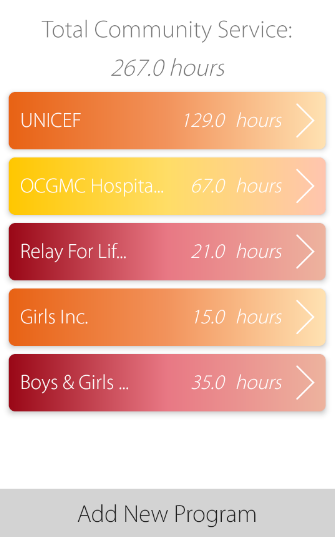
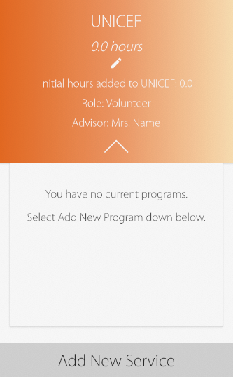
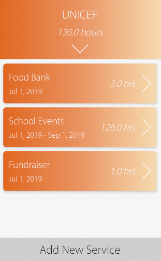
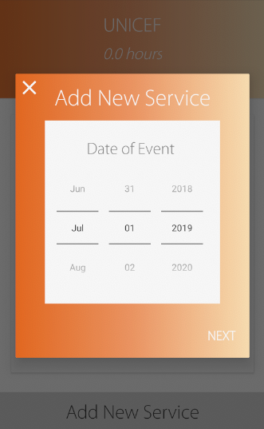
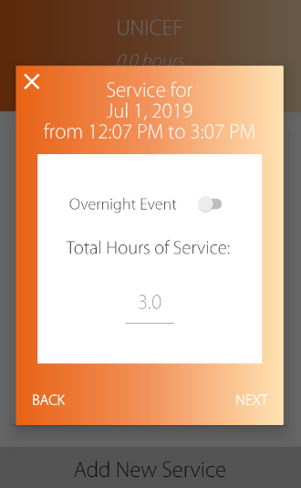
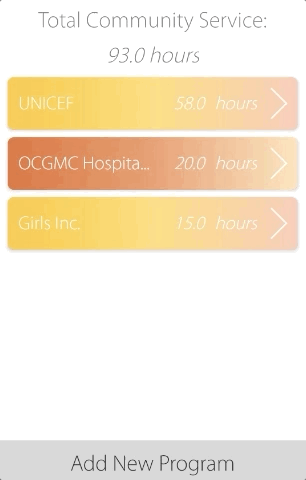
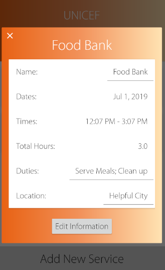

# Involve v1.0
App keeps track of community service and volunteer hours. Input your hours and record the times/dates of your service while seeing your hours all rack up. Also record your duties and positions within a program. 
Application utilizes google's material design.
## Download
Unfortunately, NOT available on Google Play because of the $25 cost of hosting and my stinginess. 
I will be making it accessible on http://slideme.org/ (because it's free!).
But you could fork it and run the APK on Android Studio's emulators. 

**SDK Information** 
**min SDK: 23** 
**target SDK: 28**

## App Structure

1. Main Page displays user's list of volunteering programs/activities/organizations
2. Program's page displays its own info. & user's list of events/services associated under the organization
3. Event/Service Page displays additional info (time, date, location, etc) of the event that was completed within an organization

### Main Page (Launch Page)
The main page first launches with an empty list of programs (First Image). But adding new programs creates a colorful design scheme (Second Image).   

### Program's Page
Page consists of a drop down view revealing the program's additional information (First Image). Adding new events creates a list view (Second Image).  

  
**Adding Events/Services** 
Adding an event to a program is as easy as it looks (First Image). No need to calculate your hours. Just input the dates and times of your event (Second Image).  

 

**Deleting a Program or Event** 
Delete either program or event by sliding the colorful list container from right to left. 

### Event's Page
Page consists of all additional info. and the ability to edit the textviews.  

